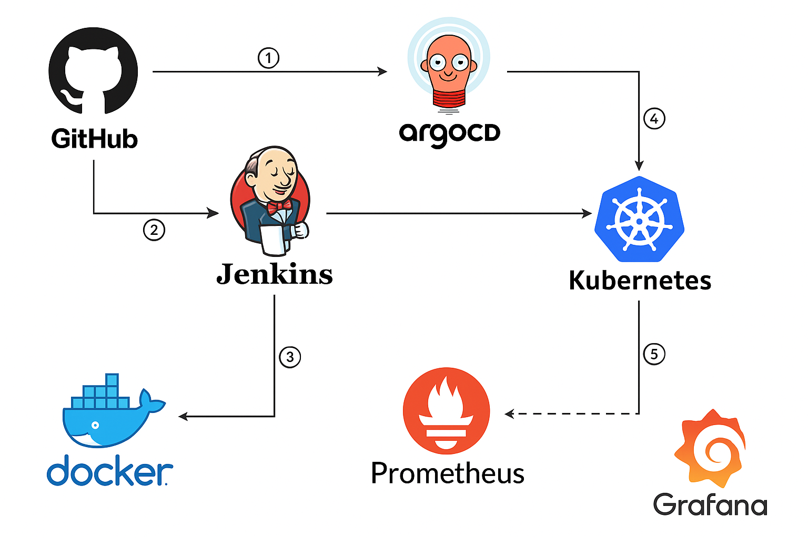

# Build and Deploy with Github, Jenkins, Argocd, Kubernetes
This is Serverinfo micro service using Python Flask Framework which displays "server name" and "ip".
This is Implementation of an automated CI/CD pipeline for deploying containerized applications using GitHub, Jenkins, Docker, ArgoCD, Kubernetes and monitoring using Prometheus, and Grafana.

##Architecture of this project

The objective of this project is to automate the build and deployment pipeline with integrated monitoring using the following tools and services:

GitHub: Store and manage source code repositories and trigger CI on commits.

Jenkins: Build application code, run tests, build Docker images, and push to container registry.

Docker: Package applications into containers for consistent deployment.

ArgoCD: Automate Kubernetes deployment using GitOps principles.

Kubernetes: Orchestrate containerized applications in a scalable environment.

Prometheus: Collect metrics from Kubernetes workloads and nodes.

Grafana: Create dashboards for observability and real-time monitoring of application and infrastructure.
