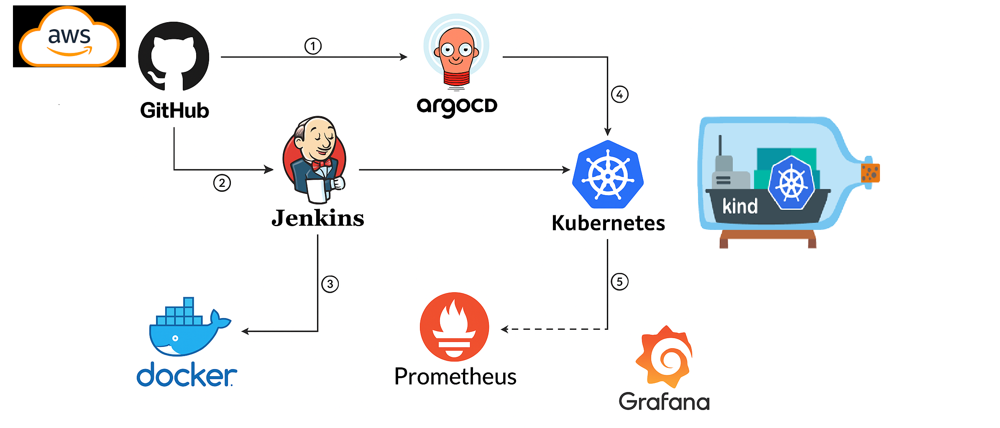

# pyserverinfo-service
This is Serverinfo micro service using Python Flask Framework which displays "server name" and "ip".
This is Implementation of an automated CI/CD pipeline for deploying containerized applications using GitHub, Jenkins, Docker, ArgoCD, Kubernetes, Prometheus, and Grafana.

##Architecture of this project

